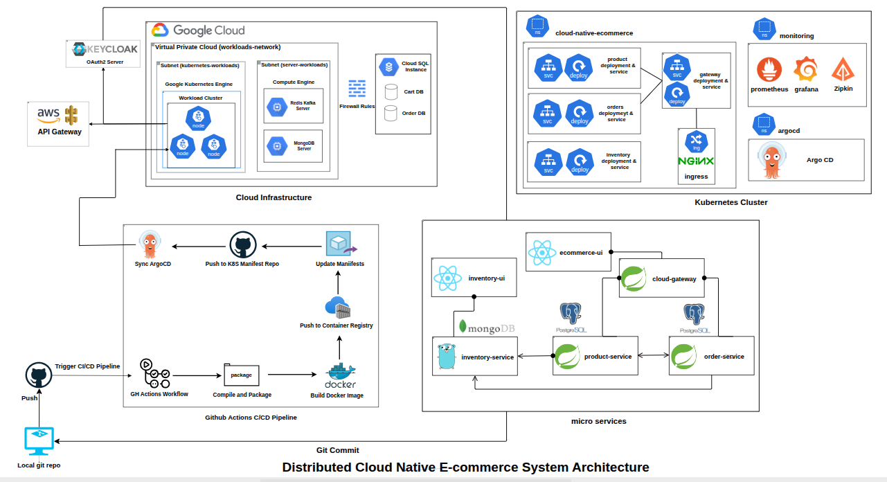
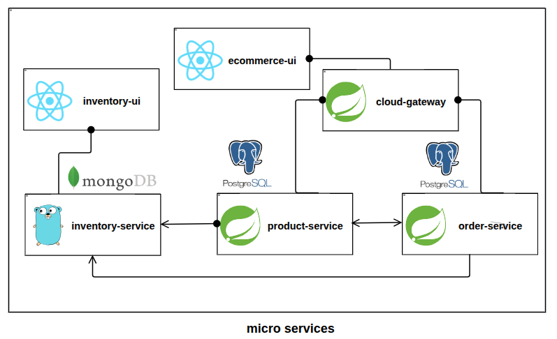
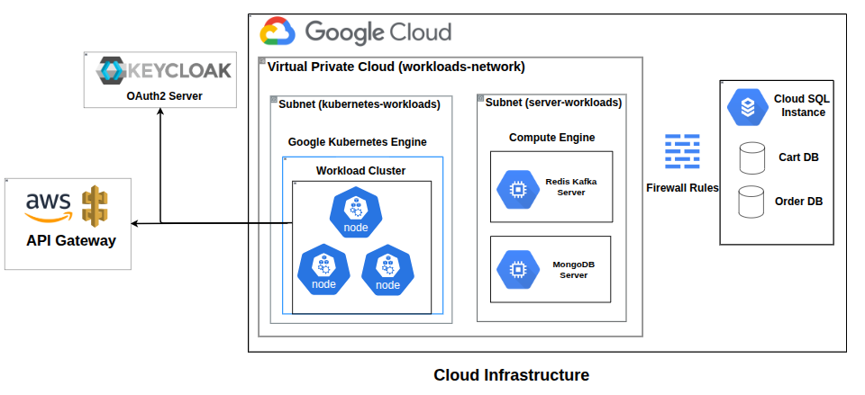
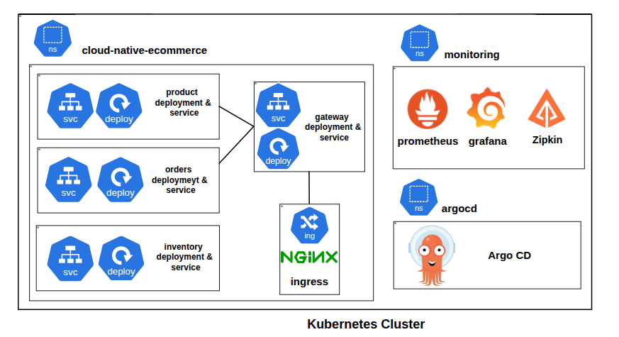
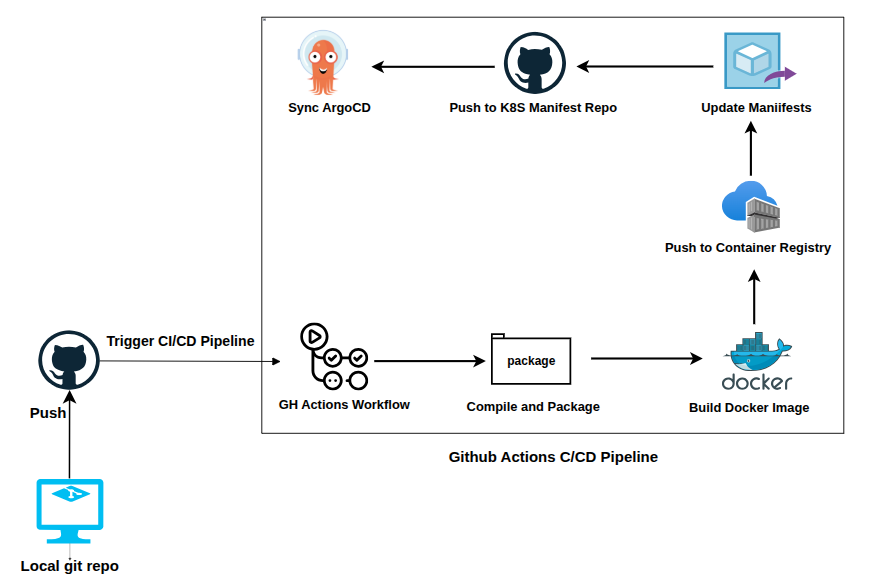

# **Cloud-Native E-commerce System**

## **B.Sc. (Engineering) Project**

**Department of Information and Communication Engineering**  
**Pabna University of Science & Technology**

**Session**: 2020-2021

**Course**: ICE-3211: Project Design and Development

---

## **Table of Contents**

1. [Project Overview](#project-overview)
2. [System Architecture](#system-architecture)
3. [Microservices](#microservices)
4. [Technology Stack](#technology-stack)
5. [Key Features](#key-features)
6. [Cloud Infrastructure](#cloud-infrastructure)
7. [Security & Authentication](#security--authentication)
8. [CI/CD Pipeline](#cicd-pipeline)
9. [Monitoring & Observability](#monitoring--observability)
10. [Infrastructure as Code](#infrastructure-as-code)
11. [Database Architecture](#database-architecture)
12. [Deployment Guide](#deployment-guide)
13. [Testing Strategy](#testing-strategy)
14. [Project Structure](#project-structure)
15. [Challenges & Learning Outcomes](#challenges--learning-outcomes)
16. [Contributors](#contributors)
17. [References](#references)

---

## **Project Overview**

This project implements a production-grade, cloud-native e-commerce platform following modern microservices architecture principles. The system demonstrates enterprise-level software engineering practices including containerization, orchestration, automated deployment, distributed tracing, and comprehensive monitoring.

### **Project Objectives**

- Design and implement a scalable microservices-based e-commerce system
- Deploy infrastructure on cloud platforms using Infrastructure as Code (IaC)
- Implement CI/CD pipelines for automated testing and deployment
- Ensure security through OAuth2 and JWT-based authentication
- Achieve observability through distributed tracing and monitoring
- Demonstrate DevOps best practices and cloud-native principles

### **Problem Statement**

Traditional monolithic e-commerce applications face challenges in scalability, maintainability, and deployment flexibility. This project addresses these challenges by implementing a microservices architecture that enables:

- Independent service scaling based on demand
- Technology diversity across services
- Fault isolation and resilience
- Continuous deployment without system-wide downtime
- Cloud-native deployment for cost optimization

---

## **System Architecture**

### **Overall Architecture**



The system follows a microservices architecture pattern with the following components:

- **4 Core Microservices**: Inventory, Product, Order, and API Gateway
- **2 Frontend Applications**: Customer UI and Inventory Management UI
- **Message Broker**: Apache Kafka for event-driven communication
- **Caching Layer**: Redis for performance optimization
- **Databases**: PostgreSQL (relational) and MongoDB (document-based)
- **Service Discovery**: Eureka for dynamic service registration
- **API Gateway**: Spring Cloud Gateway for routing and load balancing
- **Distributed Tracing**: Zipkin for request tracking across services
- **Monitoring Stack**: Prometheus and Grafana for metrics and visualization

### **Microservices Architecture**



### **Design Patterns Implemented**

1. **API Gateway Pattern**: Single entry point for all client requests
2. **Database per Service**: Each microservice has its own database
3. **Event-Driven Architecture**: Asynchronous communication via Kafka
4. **Circuit Breaker Pattern**: Fault tolerance using Resilience4j
5. **CQRS (Command Query Responsibility Segregation)**: Separate read/write operations
6. **Saga Pattern**: Distributed transaction management
7. **Service Discovery**: Dynamic service registration and discovery


---

## **Microservices**

### **1. Inventory Service**

**Technology Stack**: Go (Golang) 1.23.4, MongoDB, Redis, Apache Kafka

**Responsibilities**:
- Product inventory management and stock tracking
- Category management for product organization
- User management with role-based access control (RBAC)
- Image upload and management via Cloudinary
- Real-time stock synchronization through Kafka events
- Distributed locking for concurrent stock updates

**Architecture Pattern**: Clean Architecture (Domain-Driven Design)
- **Domain Layer**: Business entities and repository interfaces
- **Application Layer**: Use cases and business logic orchestration
- **Infrastructure Layer**: External integrations (database, cache, messaging, HTTP)

**Key Features**:
- JWT-based authentication with role-based authorization (Admin/User)
- Redis distributed locking for preventing race conditions in stock updates
- Event publishing for inventory changes to notify other services
- RESTful API with comprehensive error handling
- Unit tests with high coverage for critical business logic

**API Endpoints**:
- `POST /api/v1/users/register` - User registration
- `POST /api/v1/users/login` - User authentication
- `GET /api/v1/products` - List all products
- `POST /api/v1/products` - Create product (Admin only)
- `PUT /api/v1/products/{id}` - Update product (Admin only)
- `DELETE /api/v1/products/{id}` - Delete product (Admin only)
- `GET /api/v1/categories` - List categories
- `POST /api/v1/categories` - Create category (Admin only)
- `PUT /api/v1/stock/{productId}` - Update stock level

### **2. Product Service**

**Technology Stack**: Java 25, Spring Boot 3.5.6, PostgreSQL, Redis, Keycloak

**Responsibilities**:
- Product catalog management and CRUD operations
- Shopping cart operations (add, update, remove items)
- Product search, filtering, and pagination
- Cache management for frequently accessed products
- Integration with inventory service for stock validation
- Product availability checks

**Key Features**:
- OAuth2 resource server with Keycloak integration
- Redis caching for improved read performance
- Circuit breaker pattern using Resilience4j for fault tolerance
- OpenFeign for declarative inter-service communication
- Distributed tracing with Zipkin integration
- OpenAPI/Swagger documentation for API exploration
- Spring Boot Actuator for health checks and metrics

**Spring Boot Stack**:
- Spring Data JPA for database operations
- Spring Security with OAuth2 Resource Server
- Spring Cloud OpenFeign for HTTP clients
- Spring Cloud Circuit Breaker with Resilience4j
- Spring Boot Actuator for monitoring
- Micrometer for metrics collection

**API Endpoints**:
- `GET /api/products` - Get all products
- `GET /api/products/{id}` - Get product by ID
- `POST /api/products` - Create product
- `PUT /api/products/{id}` - Update product
- `DELETE /api/products/{id}` - Delete product
- `GET /api/cart` - Get user's cart
- `POST /api/cart/items` - Add item to cart
- `PUT /api/cart/items/{id}` - Update cart item
- `DELETE /api/cart/items/{id}` - Remove cart item

### **3. Order Service**

**Technology Stack**: Java 25, Spring Boot 3.5.6, PostgreSQL, Redis, Stripe, Apache Kafka

**Responsibilities**:
- Order creation and management
- Payment processing integration with Stripe
- Order status tracking and updates
- Inventory synchronization via Kafka consumer
- Webhook handling for payment confirmations
- Order history and retrieval

**Key Features**:
- Stripe payment gateway integration for secure transactions
- Kafka consumer for real-time inventory updates
- OAuth2 authentication with Keycloak
- Transactional consistency for order processing
- Webhook endpoint for Stripe payment event handling
- Circuit breaker for external service calls
- Idempotency for payment operations

**Order Processing Flow**:
1. User initiates checkout from shopping cart
2. Order service creates pending order record
3. Stripe payment session created and returned to client
4. User completes payment on Stripe checkout page
5. Stripe webhook confirms successful payment
6. Order status updated to confirmed
7. Inventory service notified via Kafka event
8. Stock levels updated in inventory database

**API Endpoints**:
- `POST /api/orders` - Create order
- `GET /api/orders` - Get user orders
- `GET /api/orders/{id}` - Get order details
- `POST /api/orders/checkout` - Initiate checkout
- `POST /webhook/stripe` - Stripe webhook handler

### **4. Cloud Gateway**

**Technology Stack**: Java 25, Spring Cloud Gateway

**Responsibilities**:
- API routing and load balancing across service instances
- Request/response transformation and filtering
- Rate limiting and throttling to prevent abuse
- CORS configuration for frontend access
- SSL termination (via AWS API Gateway in production)
- Authentication token validation
- Request logging and monitoring

**Gateway Features**:
- Dynamic routing based on service discovery
- Predicate-based routing rules
- Global and route-specific filters
- Circuit breaker integration
- Retry mechanism for failed requests
- Request size limiting

**Route Configuration**:
- Product Service routes: `/api/products/**`, `/api/cart/**`
- Order Service routes: `/api/orders/**`
- Inventory Service routes: `/api/inventory/**`

---

## **Technology Stack**

### **Backend Technologies**

| Service | Language/Framework | Version | Purpose |
|---------|-------------------|---------|---------|
| Inventory Service | Go (Golang) | 1.23.4 | High-performance inventory management |
| Product Service | Java, Spring Boot | 25, 3.5.6 | Product catalog and cart operations |
| Order Service | Java, Spring Boot | 25, 3.5.6 | Order processing and payments |
| Cloud Gateway | Spring Cloud Gateway | 2025.0.0 | API routing and load balancing |

### **Frontend Technologies**

| Application | Framework | Version | Key Libraries |
|-------------|-----------|---------|---------------|
| E-commerce UI | React, TypeScript | 19.1.0 | React Router, Axios, Keycloak-js, Tailwind CSS, Radix UI |
| Inventory Management UI | React, TypeScript | 18.3.1 | React Hook Form, Zod, JWT-decode, Recharts, Shadcn UI |

**Frontend Build Tools**: Vite 7.0.4 (E-commerce UI), Vite 5.4.8 (Inventory UI)

### **Databases**

- **PostgreSQL 15**: Relational database for Product and Order services
  - Deployed on Google Cloud SQL
  - Managed service with automated backups
  - Connection pooling for performance
  
- **MongoDB 7.0**: Document database for Inventory service
  - Deployed on GCP Compute Engine VM
  - Flexible schema for product attributes
  - Indexed for fast queries
  
- **Redis 7.2**: In-memory data store
  - Session management and caching
  - Distributed locking mechanism
  - Pub/Sub for real-time updates

### **Message Broker**

- **Apache Kafka 3.6**: Distributed event streaming platform
  - Asynchronous communication between services
  - Event sourcing for inventory updates
  - High throughput and low latency
  
- **Zookeeper 3.8**: Coordination service for Kafka cluster

### **Authentication & Authorization**

- **Keycloak**: Open-source Identity and Access Management
  - OAuth2 and OpenID Connect support
  - User federation and social login
  - Role-based access control
  
- **Cloud IAM**: Third-party IAM provider (cloud-iam.com)
  - Centralized authentication service
  - Multi-tenant support
  
- **JWT (JSON Web Tokens)**: Stateless authentication
  - Token-based session management
  - Claims-based authorization

### **Cloud Platforms**

#### **Google Cloud Platform (GCP)**

- **Google Kubernetes Engine (GKE)**: Managed Kubernetes cluster
  - 3-node cluster for high availability
  - Auto-scaling and self-healing
  - Integrated with GCP services
  
- **Google Cloud SQL**: Managed PostgreSQL database
  - Automated backups and point-in-time recovery
  - High availability configuration
  - Private IP connectivity
  
- **Compute Engine**: Virtual machines for stateful services
  - MongoDB server (e2-standard-4)
  - Redis & Kafka server (e2-standard-4)
  - Custom VPC networking
  
- **VPC Network**: Custom networking infrastructure
  - Isolated subnets for different workloads
  - Firewall rules for security
  - Cloud NAT for outbound connectivity

#### **Amazon Web Services (AWS)**

- **API Gateway**: HTTP API gateway
  - SSL/TLS termination
  - Custom domain routing
  - Request/response transformation
  - Rate limiting and throttling

#### **Cloudinary**

- **Cloud-based Image Management**:
  - Image upload and storage
  - On-the-fly image transformation
  - CDN delivery for fast loading
  - Automatic format optimization

#### **Netlify**

- **Frontend Hosting and CDN**:
  - E-commerce UI deployment
  - Continuous deployment from Git
  - Global CDN distribution
  - HTTPS by default
  - Automatic builds on push

### **DevOps & Infrastructure Tools**

- **Docker 24.0**: Containerization platform
- **Kubernetes 1.28**: Container orchestration
- **GitHub Actions**: CI/CD automation
- **ArgoCD 2.9**: GitOps continuous delivery
- **Terraform 1.5**: Infrastructure as Code
- **Ansible 2.15**: Configuration management
- **Prometheus 2.47**: Metrics collection
- **Grafana 10.2**: Metrics visualization
- **Zipkin 2.24**: Distributed tracing
- **Helm 3.13**: Kubernetes package manager

---

## **Key Features**

### **Functional Features**

#### **User Management**
- User registration with email verification
- Secure authentication with password hashing (bcrypt)
- Role-based access control (Admin, User)
- JWT token-based session management
- User profile management
- Password reset functionality

#### **Product Management**
- Complete CRUD operations for products
- Category-based product organization
- Product image upload and management
- Product search and filtering capabilities
- Pagination for large product catalogs
- Product availability status
- Price management

#### **Shopping Cart**
- Add products to cart with quantity selection
- Update item quantities in cart
- Remove items from cart
- Cart persistence using Redis
- Real-time price calculation
- Cart expiration after 24 hours
- Cart synchronization across sessions

#### **Order Processing**
- Order creation from cart items
- Order tracking with unique order IDs
- Order history for users
- Order status management (Pending, Confirmed, Shipped, Delivered, Cancelled)
- Order details retrieval
- Email notifications for order updates

#### **Payment Integration**
- Stripe payment gateway integration
- Secure checkout process with PCI compliance
- Multiple payment methods support
- Webhook-based payment confirmation
- Payment status tracking
- Refund handling
- Payment failure management

#### **Inventory Management**
- Real-time stock level tracking
- Automatic stock updates on order placement
- Low stock alerts for administrators
- Inventory synchronization across services via Kafka
- Stock history and audit trail
- Bulk inventory updates
- Distributed locking for concurrent updates

### **Non-Functional Features**

#### **Scalability**
- Horizontal scaling with Kubernetes deployments
- Load balancing via API Gateway and Kubernetes services
- Stateless service design for easy scaling
- Database connection pooling
- Auto-scaling based on CPU/memory metrics
- Microservices independence for selective scaling

#### **Performance**
- Redis caching for frequently accessed data (products, carts)
- Database query optimization with indexes
- CDN for static assets and images
- Lazy loading in frontend applications
- Connection pooling for database connections
- Asynchronous processing with Kafka
- Response compression

#### **Reliability**
- Circuit breaker pattern for fault tolerance
- Retry mechanisms for transient failures
- Health checks and readiness probes in Kubernetes
- Automated service recovery and self-healing
- Database replication for high availability
- Graceful degradation of services
- Backup and disaster recovery procedures

#### **Security**
- OAuth2 authentication with Keycloak
- JWT token validation and expiration
- HTTPS/TLS encryption for data in transit
- CORS configuration for frontend security
- SQL injection prevention with parameterized queries
- XSS protection in frontend
- Password hashing with bcrypt
- Secrets management with Kubernetes Secrets
- Network isolation with VPC
- Firewall rules for access control

#### **Observability**
- Distributed tracing with Zipkin for request flow visualization
- Metrics collection with Prometheus
- Dashboard visualization with Grafana
- Centralized logging (application logs)
- Application health monitoring with Spring Boot Actuator
- Real-time alerting for critical issues
- Performance monitoring and profiling

---

## **Cloud Infrastructure**



### **Google Cloud Platform (GCP) Architecture**

#### **Google Kubernetes Engine (GKE) Cluster**



**Cluster Specifications**:
- **Cluster Name**: workload-cluster
- **Node Count**: 3 nodes for high availability
- **Machine Type**: e2-standard-4 (4 vCPU, 16 GB RAM per node)
- **Disk**: 70 GB pd-balanced SSD per node
- **Location**: us-central1-c (Iowa, USA)
- **Network**: Custom VPC (workloads-network)
- **Kubernetes Version**: Latest stable from RAPID release channel
- **Gateway API**: Enabled for advanced routing

**Deployed Workloads**:
- Inventory Service: 2 replicas with resource limits
- Product Service: 2 replicas with resource limits
- Order Service: 2 replicas with resource limits
- Cloud Gateway: 2 replicas with resource limits
- E-commerce UI: 2 replicas for frontend
- Zipkin: 1 replica for distributed tracing

**Kubernetes Features Used**:
- Deployments for stateless applications
- Services for internal communication (ClusterIP)
- ConfigMaps for configuration management
- Secrets for sensitive data
- Ingress for external access
- Resource requests and limits
- Liveness and readiness probes
- Rolling updates for zero-downtime deployments

#### **Google Cloud SQL**

**Database Instance Specifications**:
- **Database Engine**: PostgreSQL 15
- **Machine Type**: db-f1-micro (shared CPU, 0.6 GB RAM)
- **Storage**: 10 GB SSD with automatic storage increase
- **High Availability**: Single zone (can be upgraded to multi-zone)
- **Backup**: Automated daily backups with 7-day retention
- **Network**: Private IP within VPC

**Databases Created**:
1. **order_db**: Order Service database
2. **cart_db**: Product Service database
3. **keycloak**: Authentication database

**Security Features**:
- SSL/TLS encryption for connections
- Private IP connectivity (no public exposure)
- IAM-based access control
- Automated security patches

#### **Compute Engine Virtual Machines**

**MongoDB Server**:
- **VM Name**: mongodb-server
- **Machine Type**: e2-standard-4 (4 vCPU, 16 GB RAM)
- **Operating System**: Ubuntu 22.04 LTS
- **Boot Disk**: 50 GB SSD persistent disk
- **Network**: server-workloads subnet
- **MongoDB Version**: 7.0
- **Configuration**: Standalone instance with authentication enabled

**Redis & Kafka Server**:
- **VM Name**: redis-kafka-server
- **Machine Type**: e2-standard-4 (4 vCPU, 16 GB RAM)
- **Operating System**: Ubuntu 22.04 LTS
- **Boot Disk**: 50 GB SSD persistent disk
- **Network**: server-workloads subnet
- **Services Running**:
  - Redis 7.2 (Port 6379)
  - Apache Kafka 3.6 (Port 9092)
  - Zookeeper 3.8 (Port 2181)

#### **Networking Architecture**

**VPC Configuration**:
- **VPC Name**: workloads-network
- **Subnet Mode**: Custom (manual subnet creation)
- **Region**: us-central1

**Subnets**:
1. **kubernetes-workloads**: 10.0.0.0/24 (GKE cluster nodes and pods)
2. **server-workloads**: 10.1.0.0/24 (MongoDB and Redis/Kafka VMs)

**Firewall Rules**:
- Allow MongoDB (27017)
- Allow Redis (6379)
- Allow Kafka (9092)
- Allow SSH (22)
- Allow all traffic within VPC

**Cloud NAT**: Provides outbound internet access for private instances

### **Amazon Web Services (AWS) Integration**

**API Gateway Configuration**:
- **Type**: HTTP API (lower latency, lower cost)
- **Custom Domain**: Configured with Route 53
- **SSL Certificate**: AWS Certificate Manager (ACM)
- **Integration**: HTTP proxy to GCP Load Balancer
- **Features**: SSL/TLS termination, rate limiting, throttling, access logging

### **Cloudinary Integration**

**Image Management Service**:
- Unlimited image storage
- On-the-fly image resizing, cropping, format conversion
- Global CDN for fast image delivery
- Automatic format optimization (WebP, AVIF)
- Responsive images for different devices

### **Netlify Deployment**

**Frontend Hosting**:
- E-commerce UI (customer-facing application)
- Continuous deployment from Git repository
- Automatic HTTPS with Let's Encrypt
- Global CDN with 100+ edge locations
- Instant cache invalidation
- Preview deployments for pull requests

---

## **Security & Authentication**

### **Authentication Architecture**

The system implements a hybrid authentication approach:
1. **Inventory Service**: JWT-based authentication
2. **Product & Order Services**: OAuth2 with Keycloak

### **Inventory Service Authentication (JWT)**

**Registration Flow**:
1. User submits registration form with username, email, password
2. Server validates input data
3. Password hashed using bcrypt with cost factor 10
4. User record created in MongoDB
5. Confirmation response sent to client

**Login Flow**:
1. User submits credentials (username/email and password)
2. Server retrieves user from database
3. Password verified against stored hash
4. JWT token generated with user claims (user_id, username, role, expiry)
5. Token returned to client with expiration time (24 hours)

**Token Validation**:
- Middleware extracts token from Authorization header
- Token signature verified with secret key
- Expiration time checked
- User claims extracted for authorization
- Role-based access control applied

### **Product & Order Services Authentication (OAuth2)**

**OAuth2 Flow (Authorization Code with PKCE)**:
1. User clicks login button in frontend
2. Frontend redirects to Keycloak authorization endpoint
3. User authenticates with Keycloak
4. Keycloak redirects back with authorization code
5. Frontend exchanges code for access token
6. Access token stored in browser
7. Token included in API requests to backend services

**Token Validation in Services**:
- Spring Security OAuth2 Resource Server validates tokens
- Token signature verified using Keycloak's public key (JWK Set)
- Token expiration and issuer checked
- User information extracted from token claims
- Spring Security context populated with user details

**Keycloak Configuration**:
- **Realm**: ecommerce
- **Client**: ecommerce-app (public client for frontend)
- **Roles**: admin, user
- **Token Lifespan**: 5 minutes (access token), 30 days (refresh token)

### **Security Best Practices Implemented**

#### **Authentication & Authorization**
- Password hashing with bcrypt (cost factor: 10)
- JWT token expiration (24 hours for inventory, 5 minutes for OAuth2)
- Refresh token rotation for OAuth2
- Role-based access control (RBAC)
- Principle of least privilege

#### **Data Protection**
- HTTPS/TLS encryption for all external communication
- TLS 1.2+ enforced
- Database connections encrypted
- Secrets stored in Kubernetes Secrets
- Environment variable injection for sensitive configuration
- No hardcoded credentials in source code

#### **API Security**
- CORS configuration with allowed origins
- Rate limiting on API Gateway (1000 req/sec)
- Request size limits (10 MB max)
- Input validation and sanitization
- SQL injection prevention with parameterized queries
- XSS protection in frontend
- CSRF protection for state-changing operations

#### **Network Security**
- VPC isolation for cloud resources
- Private IP addresses for databases
- Firewall rules restricting access
- Security groups for VM instances
- Network policies in Kubernetes
- Cloud NAT for outbound traffic only

#### **Operational Security**
- Regular security updates for dependencies
- Container image scanning for vulnerabilities
- Kubernetes pod security policies
- Service account with minimal permissions
- Audit logging for sensitive operations
- Secrets rotation policy

---

## **CI/CD Pipeline**



### **GitHub Actions Workflow**

**Trigger**: Push to `main` branch

**Pipeline Stages**:

#### **1. Test Stage**

**Matrix Strategy**: Parallel testing for all services (inventory-service, product-service, order-service)

**Test Process for Each Service**:
- Checkout source code from repository
- Setup environment (Go 1.23 for inventory-service, Java 25 for Spring Boot services)
- Download dependencies
- Run unit tests
- Generate test coverage report
- Fail pipeline if tests fail

**Test Coverage**: 100% for critical business logic (user management, product operations, category management, stock updates, JWT utilities)

#### **2. Build & Push Stage**

**Matrix Strategy**: Parallel builds for all services (product-service, order-service, inventory-service, ecommerce-ui)

**Build Process for Each Service**:
1. Checkout source code
2. Setup Docker Buildx for multi-platform builds
3. Login to Docker Hub with credentials from secrets
4. Build Docker image with Dockerfile
5. Tag image with Git commit SHA
6. Push image to Docker Hub registry
7. Tag image as `latest` for convenience

**Docker Image Naming**: `olymahmudmugdho/<service-name>:<commit-sha>`

#### **3. Update Kubernetes Manifests Stage**
1. Clone infrastructure repository (cne-k8s-manifests)
2. Update deployment YAML files with new image tags
3. Commit changes with descriptive message
4. Push to infrastructure repository
5. ArgoCD detects changes automatically

### **Continuous Deployment with ArgoCD**

**ArgoCD Configuration**:
- **Application Name**: cloud-native-ecommerce
- **Namespace**: argocd
- **Source Repository**: GitHub (cne-k8s-manifests)
- **Target Revision**: HEAD (latest commit)
- **Destination**: GKE cluster, cloud-native-ecommerce namespace

**Sync Policy**:
- **Automated Sync**: Enabled (no manual intervention required)
- **Prune**: Enabled (removes resources deleted from Git)
- **Self-Heal**: Enabled (reverts manual changes to cluster)

**ArgoCD Features Used**:
- Automatic synchronization on Git changes
- Health status monitoring for all resources
- Rollback capabilities to previous versions
- Diff view for comparing desired vs actual state
- Sync waves for ordered deployment

### **Complete Deployment Flow**

1. Developer commits code changes to GitHub
2. GitHub Actions workflow triggered automatically
3. Unit tests executed for inventory service
4. Docker images built for all services
5. Images tagged with commit SHA and pushed to Docker Hub
6. Kubernetes manifests updated in infrastructure repository
7. ArgoCD detects changes in infrastructure repository
8. ArgoCD syncs changes to GKE cluster
9. Kubernetes performs rolling update of deployments
10. Health checks validate new pods
11. Old pods terminated after successful deployment
12. Deployment complete with zero downtime

**Deployment Time**: Approximately 5-10 minutes from commit to production

---

## **Monitoring & Observability**

### **Prometheus - Metrics Collection**

**Deployment Method**: Helm chart (kube-prometheus-stack)

**Metrics Collected**:

**Application Metrics**:
- HTTP request rate (requests per second)
- HTTP request duration (latency percentiles: p50, p95, p99)
- HTTP error rate (4xx, 5xx responses)
- Active requests (concurrent requests)
- Database query duration
- Database connection pool usage
- Cache hit/miss ratios
- Kafka message production/consumption rates

**Infrastructure Metrics**:
- CPU usage per pod and node
- Memory usage per pod and node
- Disk I/O operations
- Network traffic (bytes in/out)
- Pod restart count
- Node status and availability

**Business Metrics**:
- Total orders created
- Order success/failure rate
- Revenue per time period
- Active users
- Cart abandonment rate
- Product views and purchases

**Scrape Configuration**:
- Spring Boot Services: `/actuator/prometheus` endpoint
- Go Service: `/metrics` endpoint
- Kubernetes Metrics: kube-state-metrics
- Node Metrics: node-exporter

**Scrape Interval**: 15 seconds  
**Retention Period**: 15 days

### **Grafana - Metrics Visualization**

**Deployment**: Included in kube-prometheus-stack Helm chart

**Dashboards Implemented**:

1. **Service Overview Dashboard**: Request rate, response time, error rate, service availability, top slowest endpoints
2. **Infrastructure Dashboard**: Cluster CPU/memory usage, node utilization, pod status, persistent volume usage, network traffic
3. **Database Dashboard**: Query execution time, connection pool metrics, slow queries, database size, transaction rate
4. **Business Metrics Dashboard**: Orders per hour/day, revenue trends, user activity, product popularity, cart conversion rate

**Alerting**:
- Alert rules configured in Prometheus
- Notifications via email/Slack (configurable)
- Alert conditions: Service down > 5 minutes, error rate > 5%, response time > 2 seconds (p95), CPU usage > 80%, memory usage > 85%

### **Zipkin - Distributed Tracing**

**Deployment Method**: Helm chart (openzipkin/zipkin)

**Purpose**: Track requests across multiple microservices

**Trace Information Captured**:
- Trace ID (unique per request)
- Span ID (unique per service call)
- Parent Span ID (for nested calls)
- Service name and operation name
- Start time and duration
- Tags (HTTP method, status code, etc.)
- Annotations (custom events)

**Integration**:
- Spring Boot Services: Micrometer Tracing with Brave
- Sampling Rate: 100% (all requests traced)
- Reporter: HTTP reporter to Zipkin server

**Use Cases**:
- Identify performance bottlenecks
- Debug inter-service communication issues
- Analyze request flow and dependencies
- Measure service-to-service latency
- Root cause analysis for errors

---

## **Infrastructure as Code**

### **Terraform - Cloud Infrastructure Provisioning**

**Managed Resources**:

**Networking**:
- VPC network (workloads-network)
- Two subnets (kubernetes-workloads, server-workloads)
- Firewall rules for MongoDB, Redis, Kafka, SSH
- Cloud Router for NAT gateway
- Cloud NAT for outbound internet access

**Compute Resources**:
- GKE cluster with 3 nodes
- MongoDB VM (e2-standard-4)
- Redis/Kafka VM (e2-standard-4)

**Database**:
- Cloud SQL PostgreSQL instance
- Three databases (order_db, cart_db, keycloak)
- Database users with appropriate permissions

**Configuration Variables**:
- Project ID, region and zone
- Machine types
- Network names
- Database credentials

### **Ansible - Configuration Management**

**Playbooks Available**:
1. **gcp_login.yaml**: Authenticate with GCP
2. **setup-mongodb.yaml**: Install and configure MongoDB
3. **setup-redis-kafka.yaml**: Install Redis, Kafka, and Zookeeper
4. **deploy-mongodb.yaml**: Deploy MongoDB with security settings
5. **fetch-k8s-credentials.yaml**: Configure kubectl access to GKE

**Configuration Tasks**:
- Package installation (apt/yum)
- Service configuration files
- Firewall setup (ufw/iptables)
- User and permission management
- Service startup and enablement
- Security hardening

---

## **Database Architecture**

### **PostgreSQL Databases**

**Product Service Database (cart_db)**:
- **Tables**: products, carts, cart_items
- **Relationships**: One cart per user, many cart items per cart, each cart item references a product
- **Indexes**: Primary keys, foreign key indexes, index on user_id

**Order Service Database (order_db)**:
- **Tables**: orders, order_items, payment_transactions
- **Relationships**: One order per transaction, many order items per order, one payment transaction per order
- **Indexes**: Primary keys, foreign key indexes, index on user_id and status, index on payment_id

### **MongoDB Collections**

**Inventory Service Database (inventory_db)**:

**Collections**:
1. **users**: username, email, password (hashed), role, timestamps
   - Indexes: Unique index on email, index on username

2. **products**: name, description, price, category_id, image_url, stock, timestamps
   - Indexes: Index on category_id, text index on name and description

3. **categories**: name, description, created_at
   - Indexes: Unique index on name

4. **user_info**: user_id, full_name, phone, address, preferences
   - Indexes: Index on user_id

### **Redis Data Structures**

**Key Patterns**:
- `product:{id}` → Product details (Hash)
- `cart:{user_id}` → User cart items (Hash)
- `session:{token}` → User session data (String)
- `stock:lock:{product_id}` → Distributed lock (String with TTL)

**Expiration Policies**:
- Product cache: 1 hour (3600 seconds)
- Cart cache: 24 hours (86400 seconds)
- Session: 24 hours (86400 seconds)
- Lock: 10 seconds (auto-release)

**Persistence**: RDB snapshots every 15 minutes if at least 1 key changed


---

## **Deployment Guide**

> **📖 For detailed deployment instructions, see [DEPLOYMENT.md](DEPLOYMENT.md)**

### **Quick Start - Production Deployment**

The project includes an automated deployment system using Makefile orchestration:

```bash
# Validate prerequisites
make check

# Deploy complete infrastructure (5-10 minutes)
make deploy-all

# Or deploy individual stages
make 01-infrastructure    # GCP infrastructure (Terraform) - 10-15 min
make 02-configuration     # VM configuration (Ansible) - 5-10 min
make 03-kubernetes        # K8s workloads - 2-3 min
make 04-monitoring        # Prometheus, Grafana, Zipkin - 2-3 min
make 05-finalize          # Extract variables & set secrets - 1 min
```

**Deployment Stages:**
1. **01-infrastructure** - Provisions GCP resources (VPC, GKE, Cloud SQL, VMs)
2. **02-configuration** - Configures VMs with Ansible (MongoDB, Redis, Kafka)
3. **03-kubernetes** - Deploys microservices and ArgoCD to GKE (non-blocking)
4. **04-monitoring** - Installs monitoring stack (Prometheus, Grafana, Zipkin)
5. **05-finalize** - Extracts IPs and credentials, updates GitHub secrets

**Note:** Pods start in background. Check status with:
```bash
kubectl get pods -n cloud-native-ecommerce
kubectl get svc -n cloud-native-ecommerce  # LoadBalancer IPs take 5-10 min
```

**Cleanup:**
```bash
make destroy-all          # Destroy everything (with confirmation)
make destroy-kubernetes   # Destroy only K8s workloads
make destroy-monitoring   # Destroy only monitoring stack
make destroy-infrastructure  # Destroy only GCP infrastructure
```

**Verbose Mode:**
```bash
make deploy-all VERBOSE=1  # Show detailed output
```

### **Prerequisites**

**Required Tools**:
- jq, yq, sponge (moreutils)
- Ansible 2.15+
- Terraform 1.5+
- Helm 3.13+
- kubectl
- gcloud CLI (Google Cloud SDK)

**Required Files**:
- `infrastructure/account.json` - GCP service account key
- `infrastructure/terraform.tfvars` - Terraform variables
- `ansible/inventory/inventory.ini` - Ansible inventory
- `k8s/secret.yaml` - Kubernetes secrets (create from `k8s/secret-demo.yaml`)

**Cloud Accounts**:
- Google Cloud Platform account with billing enabled
- Docker Hub account
- GitHub account
- Stripe account (for payment integration)
- Cloudinary account (for image management)
- Netlify account (for frontend hosting)

### **Setup Before Deployment**

1. **Create Kubernetes secrets:**
```bash
cd k8s
cp secret-demo.yaml secret.yaml
# Edit secret.yaml with base64 encoded values
```

2. **Configure Terraform variables:**
```bash
cd infrastructure
# Edit terraform.tfvars with your GCP project details
```

3. **Update Ansible inventory:**
```bash
cd ansible
# Edit inventory/inventory.ini with VM IPs (after infrastructure deployment)
```

### **Part 1: Local Development Setup**

#### **Step 1: Clone Repository**

```bash
git clone https://github.com/OlyMahmudMugdho/cloud-native-ecommerce.git
cd cloud-native-ecommerce
```

#### **Step 2: Start Infrastructure with Docker Compose**

```bash
cd docker
docker-compose up -d
docker-compose ps  # Verify all containers are running
```

**Services Started**: PostgreSQL (5432), MongoDB (27017), Redis (6379), Kafka (9092), Zookeeper (2181), Zipkin (9411)

**Wait Time**: 2-3 minutes for initialization

#### **Step 3: Configure and Run Inventory Service**

```bash
cd inventory-service
cp config.demo.yaml config.yaml
# Edit config.yaml with your values (MongoDB URI, Redis, Kafka, JWT secret, Cloudinary credentials)
go mod download
go run cmd/main.go
```

**Verify**: Service runs on http://localhost:8082

#### **Step 4: Configure and Run Product Service**

```bash
cd product-service
# Edit src/main/resources/application.yaml (PostgreSQL, Redis, Keycloak URLs)
./mvnw clean install
./mvnw spring-boot:run
```

**Verify**: Service runs on http://localhost:8081

#### **Step 5: Configure and Run Order Service**

```bash
cd order-service
# Edit src/main/resources/application.yaml (PostgreSQL, Redis, Stripe key, Kafka)
./mvnw clean install
./mvnw spring-boot:run
```

**Verify**: Service runs on http://localhost:8083

#### **Step 6: Run Cloud Gateway**

```bash
cd cloud-gateway
./mvnw clean install
./mvnw spring-boot:run
```

**Verify**: Gateway runs on http://localhost:8080

#### **Step 7: Run E-commerce Frontend**

```bash
cd ecommerce-ui
npm install
cp .env.example .env
# Edit .env (API URL, Keycloak configuration)
npm run dev
```

**Access**: http://localhost:5173

#### **Step 8: Run Inventory Management Frontend**

```bash
cd inventory-frontend
npm install
npm run dev
```

**Access**: http://localhost:5174

### **Part 2: Production Deployment on GCP**

#### **Step 1: Setup GCP Project**

```bash
gcloud auth login
gcloud config set project your-project-id
gcloud services enable compute.googleapis.com container.googleapis.com sqladmin.googleapis.com
gcloud config set compute/region us-central1
gcloud config set compute/zone us-central1-c
```

#### **Step 2: Create Service Account for Terraform**

```bash
gcloud iam service-accounts create terraform-sa --display-name="Terraform Service Account"
gcloud projects add-iam-policy-binding your-project-id \
    --member="serviceAccount:terraform-sa@your-project-id.iam.gserviceaccount.com" \
    --role="roles/editor"
gcloud iam service-accounts keys create ~/terraform-key.json \
    --iam-account=terraform-sa@your-project-id.iam.gserviceaccount.com
export GOOGLE_APPLICATION_CREDENTIALS=~/terraform-key.json
```

#### **Step 3: Deploy Infrastructure with Terraform**

```bash
cd infrastructure
cp ~/terraform-key.json ./auth
terraform init
terraform plan -var="project=your-project-id" \
               -var="postgres_username=dbadmin" \
               -var="postgres_password=YourStrongPassword123!"
terraform apply -var="project=your-project-id" \
                -var="postgres_username=dbadmin" \
                -var="postgres_password=YourStrongPassword123!"
# Type 'yes' when prompted
# Wait 10-15 minutes for completion
terraform output > terraform-outputs.txt
```

**Resources Created**: VPC, GKE cluster (3 nodes), Cloud SQL, 2 VMs, Firewall rules, Cloud NAT

#### **Step 4: Configure VMs with Ansible**

```bash
cd ansible
cp .env.demo .env
# Edit .env with GCP project ID, VM IPs, SSH details
# Update inventory/inventory.ini with VM external IPs
ansible all -i inventory/inventory.ini -m ping  # Test connectivity
./run1.sh  # Setup MongoDB
./run2.sh  # Setup Redis & Kafka
./run3.sh  # Fetch Kubernetes credentials
```

#### **Step 5: Configure kubectl Access**

```bash
gcloud container clusters get-credentials workload-cluster \
    --zone=us-central1-c --project=your-project-id
kubectl cluster-info
kubectl get nodes  # Should show 3 nodes in Ready state
```

#### **Step 6: Create Kubernetes Namespace**

```bash
cd k8s
kubectl apply -f namespace.yaml
kubectl config set-context --current --namespace=cloud-native-ecommerce
```

#### **Step 7: Create Kubernetes Secrets**

```bash
cp secret-demo.yaml secret.yaml
# Encode secrets: echo -n "your-secret" | base64
# Update secret.yaml with base64 encoded values
kubectl apply -f secret.yaml
```

#### **Step 8: Create ConfigMap**

```bash
# Edit configmap.yaml with MongoDB URI, Redis host, Kafka brokers, PostgreSQL URLs, Keycloak URLs
kubectl apply -f configmap.yaml
```

#### **Step 9: Deploy Zipkin**

```bash
kubectl apply -f zipkin.yaml
kubectl wait --for=condition=available --timeout=300s deployment/zipkin
```

#### **Step 10: Deploy Microservices**

```bash
kubectl apply -f inventory/
kubectl apply -f product/
kubectl apply -f order/
kubectl apply -f gateway/
kubectl apply -f ecommerce-ui/
kubectl wait --for=condition=available --timeout=600s deployment --all
kubectl get pods  # Verify all pods are running
```

#### **Step 11: Deploy Ingress**

```bash
kubectl apply -f ingress.yaml
kubectl get ingress -w  # Wait for external IP (5-10 minutes)
```

#### **Step 12: Install Monitoring Stack**

```bash
cd scripts
chmod +x deploy_all.sh
./deploy_all.sh
# Get Grafana external IP
kubectl get svc prometheus-stack-grafana -n default
# Get Grafana password
kubectl get secret prometheus-stack-grafana -n default -o jsonpath="{.data.admin-password}" | base64 -d
```

**Access Grafana**: http://GRAFANA_EXTERNAL_IP (Username: admin)

#### **Step 13: Setup ArgoCD**

```bash
kubectl create namespace argocd
kubectl apply -n argocd -f https://raw.githubusercontent.com/argoproj/argo-cd/stable/manifests/install.yaml
kubectl wait --for=condition=available --timeout=600s deployment --all -n argocd
# Get ArgoCD password
kubectl -n argocd get secret argocd-initial-admin-secret -o jsonpath="{.data.password}" | base64 -d
# Port forward
kubectl port-forward svc/argocd-server -n argocd 8080:443
# Access: https://localhost:8080 (Username: admin)
# Deploy application
kubectl apply -f k8s/argocd/deployment.yaml
```

#### **Step 14: Configure GitHub Actions CI/CD**

In GitHub repository Settings > Secrets and variables > Actions, add:
- `DOCKER_HUB_USERNAME`: Docker Hub username
- `DOCKER_HUB_TOKEN`: Docker Hub access token
- `GCP_PROJECT_ID`: GCP project ID
- `GCP_SA_KEY`: Service account key JSON content

**Test CI/CD**: Make a change, commit, push to main branch, monitor GitHub Actions and ArgoCD

#### **Step 15: Deploy Frontend to Netlify**

```bash
cd ecommerce-ui
npm run build
npm install -g netlify-cli
netlify login
netlify init  # Follow prompts
netlify deploy --prod
```

**Configure Environment Variables in Netlify**:
- `VITE_API_URL`: API Gateway URL
- `VITE_KEYCLOAK_URL`: Keycloak URL
- `VITE_KEYCLOAK_REALM`: ecommerce
- `VITE_KEYCLOAK_CLIENT_ID`: ecommerce-app

**Setup Continuous Deployment**: Connect GitHub repository to Netlify

#### **Step 16: Verify Complete Deployment**

**Check Services**:
```bash
kubectl get pods --all-namespaces
kubectl get svc --all-namespaces
kubectl get ingress
kubectl get applications -n argocd
```

**Test Application**:
1. Access frontend via Netlify URL
2. Register and login
3. Browse products
4. Add to cart
5. Create order
6. Complete payment (Stripe test card: 4242 4242 4242 4242)
7. Verify order history

**Check Monitoring**:
1. Access Grafana dashboard
2. View service metrics
3. Access Zipkin UI
4. View distributed traces

### **Part 3: Maintenance and Operations**

#### **Scaling Services**

```bash
# Manual scaling
kubectl scale deployment inventory-service --replicas=3
# Auto-scaling
kubectl autoscale deployment product-service --cpu-percent=70 --min=2 --max=10
kubectl get hpa
```

#### **Updating Services**

```bash
# Update image
kubectl set image deployment/product-service product-service=olymahmudmugdho/product-service:new-tag
# Check rollout
kubectl rollout status deployment/product-service
# Rollback if needed
kubectl rollout undo deployment/product-service
```

#### **Monitoring and Troubleshooting**

```bash
# View logs
kubectl logs -f deployment/product-service
kubectl logs -f -l app=product-service
# Debug pod
kubectl describe pod pod-name
kubectl exec -it pod-name -- /bin/bash
# Check events
kubectl get events --sort-by='.lastTimestamp'
```

#### **Backup and Restore**

```bash
# Cloud SQL backup
gcloud sql backups create --instance=postgres-instance
gcloud sql backups list --instance=postgres-instance
# MongoDB backup
gcloud compute ssh mongodb-server
mongodump --out=/backup/$(date +%Y%m%d)
```

---

## **Testing Strategy**

### **Unit Testing**

**Inventory Service (Go)**:
- Test coverage: 100% for critical business logic
- Framework: Go testing package with testify
- Execution: `go test -v ./...` and `go test -cover ./...`

**Product & Order Services (Java)**:
- Framework: JUnit 5, Mockito, Spring Boot Test
- Execution: `./mvnw test` and `./mvnw test jacoco:report`

### **Integration Testing**

- API testing with Postman collections
- Database migration testing
- Transaction rollback testing

### **End-to-End Testing**

**Manual Testing Checklist**:
- User registration and login
- Product listing and search
- Cart operations
- Checkout and payment
- Order confirmation and history
- Admin product and inventory management

### **Performance Testing**

- Load testing with Apache JMeter or k6
- Scenarios: 100 concurrent users, 1000 req/sec, 30-minute sustained load
- Stress testing to identify bottlenecks

### **Security Testing**

- Container image scanning with Trivy
- Dependency scanning with Snyk
- OWASP ZAP for API security
- Penetration testing for SQL injection, XSS, authentication bypass

---

## **Project Structure**

```
cloud-native-ecommerce/
├── .github/workflows/          # CI/CD pipeline
├── ansible/                    # Configuration management
│   ├── inventory/
│   ├── playbooks/
│   └── scripts/
├── architecture/               # Architecture diagrams
├── cloud-gateway/              # API Gateway service
├── docker/                     # Docker Compose files
├── ecommerce-ui/               # Customer frontend
├── infrastructure/             # Terraform IaC
├── inventory-frontend/         # Inventory management UI
├── inventory-service/          # Inventory microservice (Go)
├── k8s/                        # Kubernetes manifests
│   ├── argocd/
│   ├── ecommerce-ui/
│   ├── gateway/
│   ├── inventory/
│   ├── order/
│   └── product/
├── order-service/              # Order microservice (Java)
├── product-service/            # Product microservice (Java)
├── scripts/                    # Deployment scripts
└── service-registry/           # Eureka service registry
```

---

## **Challenges & Learning Outcomes**

### **Technical Challenges**

1. **Distributed Transaction Management**: Implementing saga pattern for order processing across multiple services
2. **Service Communication**: Handling network failures and implementing circuit breakers
3. **Data Consistency**: Maintaining consistency between PostgreSQL and MongoDB
4. **Distributed Locking**: Preventing race conditions in concurrent stock updates
5. **Authentication Complexity**: Integrating multiple authentication mechanisms (JWT and OAuth2)
6. **Infrastructure Automation**: Managing complex cloud infrastructure with Terraform
7. **Monitoring Setup**: Configuring comprehensive observability across all services

### **Learning Outcomes**

**Technical Skills**:
- Microservices architecture design and implementation
- Containerization with Docker and orchestration with Kubernetes
- Cloud infrastructure management on GCP
- Infrastructure as Code with Terraform
- Configuration management with Ansible
- CI/CD pipeline implementation with GitHub Actions and ArgoCD
- Distributed tracing and monitoring
- Event-driven architecture with Kafka
- OAuth2 and JWT authentication
- Payment gateway integration

**Software Engineering Practices**:
- Clean architecture and domain-driven design
- Test-driven development
- GitOps workflow
- DevOps best practices
- Security best practices
- API design and documentation

**Cloud-Native Principles**:
- Scalability and elasticity
- Fault tolerance and resilience
- Observability and monitoring
- Continuous deployment
- Infrastructure automation

---

## **Contributors**

**Project Team**:
- **Name**: M. Oly Mahmud
- **Email**: oly.210614@s.pust.ac.bd | oly.ice.pust@gmail.com | mugdhodzs38@gmail.com
- **Department**: Information and Communication Engineering
- **Institution**: Pabna University of Science & Technology
- **Session**: 2020-2021
- **Course**: ICE-3211: Project Design and Development

**Project Supervisor**:
- **Name**: Professor Dr. Md. Anwar Hossain
- **Department**: Information and Communication Engineering

---

## **References**

### **Documentation**

1. Spring Boot Documentation: https://spring.io/projects/spring-boot
2. Go Documentation: https://go.dev/doc/
3. Kubernetes Documentation: https://kubernetes.io/docs/
4. Docker Documentation: https://docs.docker.com/
5. Terraform Documentation: https://www.terraform.io/docs
6. Ansible Documentation: https://docs.ansible.com/
7. Prometheus Documentation: https://prometheus.io/docs/
8. Grafana Documentation: https://grafana.com/docs/
9. ArgoCD Documentation: https://argo-cd.readthedocs.io/

### **Technologies**

1. Apache Kafka: https://kafka.apache.org/
2. Redis: https://redis.io/
3. MongoDB: https://www.mongodb.com/
4. PostgreSQL: https://www.postgresql.org/
5. Keycloak: https://www.keycloak.org/
6. Stripe API: https://stripe.com/docs/api
7. Cloudinary: https://cloudinary.com/documentation
8. Google Cloud Platform: https://cloud.google.com/docs
9. AWS API Gateway: https://docs.aws.amazon.com/apigateway/
10. Netlify: https://docs.netlify.com/

### **Books and Articles**

1. "Microservices Patterns" by Chris Richardson
2. "Building Microservices" by Sam Newman
3. "Kubernetes in Action" by Marko Lukša
4. "Site Reliability Engineering" by Google
5. "The DevOps Handbook" by Gene Kim

---

## **License**

This project is developed for academic purposes as part of the B.Sc. (Engineering) program at the Department of Information and Communication Engineering, Pabna University of Science & Technology.

---

## **Acknowledgments**

We would like to express our gratitude to:
- Department of Information and Communication Engineering, PUST
- Project supervisor for guidance and support
- Open-source community for excellent tools and frameworks
- Cloud providers for educational credits

---

**Project Repository**: https://github.com/OlyMahmudMugdho/cloud-native-ecommerce

**Documentation Last Updated**: February 25, 2026
